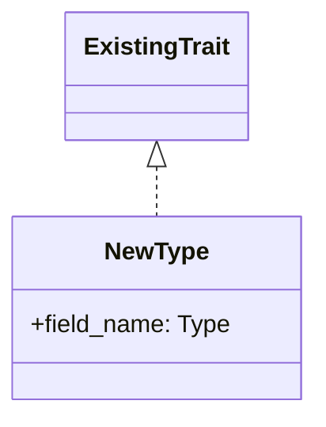

# GitHub Issue Creation Guidelines

This file contains the authoritative guidelines for creating GitHub Issues in this project.
It is referenced by the `/issue` skill during Issue drafting.

## Purpose

Issues serve as the foundation for development work in this project. Well-written issues enable:
- AI agents to implement features autonomously
- Clear communication of requirements and technical specifications
- Consistent documentation of decisions and rationale

## Key Principles

1. **Language**: Always write issues in **English**
   - Applies to: Issue title, description, code examples, acceptance criteria
   - No exceptions

2. **Dual-Audience Structure**: Every Issue serves two readers at once
   - **Humans read the top section only** — Summary, Why, Design Sketch, Scope,
     Acceptance Criteria. A reviewer must grasp what and why in under a minute
     without opening the collapsed block.
   - **AI agents read both sections** — the collapsed
     `🤖 Implementation Spec (for AI agents)` block carries file paths, precedent
     Issues/PRs, invariants, and design decisions.
   - Never duplicate the same information in both sections; the human section is a
     summary, the AI section is the specification.
   - Document design decisions and rationale explicitly, in prose — not in code.

3. **Completeness**: An issue should answer "Can an AI implement this without asking for clarification?"
   - The test applies to the **combined body** (human section + AI section), not to
     either section alone
   - If the answer is no, add more detail — to the AI section, not the human section

## Issue Structure Template

Use this structure for all issues (see the Bug Report variant under Issue Types).
The first five headings are the **human section**; everything inside `<details>` is
the **AI section**.

```markdown
## Summary
[2–3 sentences: what changes and what value it provides. No implementation detail.]

## Why
- [Reason / pain point 1]
- [Reason / pain point 2]
- [Reason / pain point 3]

## Design Sketch
[Minimal Mermaid classDiagram of NEW or CHANGED types only: type names, key fields,
trait implementations and relationships. No method bodies, no existing untouched types.
Omit this section entirely when the Issue changes no types (bugs, docs, process).]



## Scope
**In**
- [What this Issue delivers]

**Out**
- [Explicitly excluded, with a one-line reason or a follow-up Issue reference]

## Acceptance Criteria
- [ ] [Behavior-level, human-verifiable outcome 1]
- [ ] [Behavior-level, human-verifiable outcome 2]

<details>
<summary>🤖 Implementation Spec (for AI agents)</summary>

## Context & Constraints
- [Existing pattern this must follow, with file path]
- [Precedent Issue/PR: "#N did the same for X"]
- [Invariants that apply (see `.claude/CLAUDE.md` → Important Invariants)]
- [Anything explicitly NOT to touch]

## Design Decisions
- **[Decision]** — [rationale, in prose. Name the exact types, traits and functions
  involved; describe the change rather than writing it.]
- **[Alternative rejected]** — [why]

## Files to Update/Create
1. `path/to/file1.rs` — [what changes]
2. `path/to/new_file.rs` — [what to create, which layer, and why]

## Technical Acceptance Criteria
- [ ] All existing tests pass (`cargo test --all`)
- [ ] New tests added for new functionality (if applicable)
- [ ] Formatted with `cargo fmt --all`
- [ ] No new Clippy warnings (`cargo clippy --all-targets --all-features -- -D warnings`)
- [ ] Documentation updated (if user-facing change; see `/implement` Step 4.3)
- [ ] No speculative `#[allow(dead_code)]` (see `.claude/CLAUDE.md` → Dead Code Policy)

</details>
```

**Formatting rules for the `<details>` block:**
- Leave a blank line after `<summary>` and before `</details>`, or GitHub renders the
  inner Markdown as literal text.
- `## Triage & Competitive Analysis` goes first inside the block when the Issue was
  produced by `/ideate`.
- Never nest a second `<details>` inside the AI section.

## Issue Types

### Feature Request Template

Use the **Issue Structure Template** above unchanged. It is the feature template.
Do not maintain a second copy here — divergence between the two is how the old
format drifted.

### Bug Report Template

```markdown
## Summary
[1–2 sentences: what is broken and who it affects.]

## Current Behavior
[What happens now. A reproduction command and its real error output are allowed here.]

## Expected Behavior
[What should happen instead.]

## Steps to Reproduce
1. [Step 1]
2. [Step 2]

## Acceptance Criteria
- [ ] [Observable behavior after the fix]
- [ ] The reproduction above no longer triggers the failure

<details>
<summary>🤖 Implementation Spec (for AI agents)</summary>

## Root Cause Analysis
- Environment: [OS, Rust version, uv-sbom version — if relevant]
- [Which file/function is responsible and why the current logic fails, in prose,
  citing `path/to/file.rs:LINE`]

## Proposed Fix
- [The fix described in prose: which function changes, what the new behavior is,
  and why this approach over the alternatives. No implementation code.]

## Files to Update/Create
1. `path/to/file.rs` — [what changes]

## Technical Acceptance Criteria
- [ ] Regression test added that fails before the fix and passes after
- [ ] All existing tests pass (`cargo test --all`)
- [ ] Formatted with `cargo fmt --all`
- [ ] No new Clippy warnings (`cargo clippy --all-targets --all-features -- -D warnings`)

</details>
```

## No Implementation Code in Issue Bodies

Issue bodies MUST NOT contain implementation code. Code design is produced by the
Architect agent at `/implement` Step 3.5, against the codebase as it exists at
implementation time — code written at Issue time duplicates that work and goes stale
before anyone reads it.

**Allowed exceptions** (these are the only fenced code blocks permitted):

| Exception | Example |
|-----------|---------|
| Bug reproduction commands and their real error output | ` ```bash\ncargo run -- -p examples/sample-project --no-network\n``` ` |
| User-facing CLI usage and expected output | Still subject to the #669 real-output rule: output must be produced by actually running the command, never hand-written |
| The Mermaid `classDiagram` in `## Design Sketch` | Types, fields, and relationships only — no method bodies |
| A minimal verbatim excerpt of **existing** code quoted as inert evidence | Used by `/code-review` Step 3.5 when citing a flagged line. Evidence only — never proposed or new code |

Anything else — proposed function bodies, new struct definitions in Rust, "here is
roughly how this should look" snippets — belongs in `## Design Decisions` as prose
that names the exact types, traits, and functions involved.

## Writing for AI Implementation

1. **Be Specific Without Writing Code** — Name the exact types, traits, functions, and
   modules involved and describe the change in prose. Do not write implementation code
   (see "No Implementation Code in Issue Bodies"); `/implement` Step 3.5 produces the
   interface design.
2. **Include File Paths** — Specify exact paths: `src/sbom_generation/services/package_filter.rs`
3. **Specify Design Decisions Explicitly** — "Use Strategy pattern" not "Improve the design"
4. **Document Assumptions and Constraints** — Security, performance, backward compatibility
5. **Provide Context** — Reference related code, issues, or architectural patterns
6. **Put It in the Right Section** — Human section = what and why. AI section = how,
   where, and under what constraints. If a reader needs it to decide whether the Issue
   is worth doing, it is human-section content; if they need it only to implement it,
   it is AI-section content.

## Pre-Submission Verification (MANDATORY)

Before submitting via `gh issue create`:

```
- [ ] VERIFY: Entire issue content is in English (title and body)
- [ ] CHECK: All template sections are present, in the canonical order
- [ ] CHECK: AI section is wrapped in `<details><summary>🤖 Implementation Spec (for AI agents)</summary>` with a blank line after `<summary>` and before `</details>`
- [ ] VERIFY: The human section alone answers "what is this and why" in under a minute
- [ ] VERIFY: No implementation code outside the allowed exceptions; any allowed code block uses proper markdown formatting
- [ ] CHECK: Acceptance criteria use checklist format
- [ ] VERIFY: File paths are specific and accurate
- [ ] FINAL: Re-read the full issue as if you were an AI implementing it
```

**Why this checklist is necessary**:
- Catches language violations before submission (Incident: PR #121 — Issue created in Japanese)
- Creates a moment for reflection and review
- Prevents the need to edit issues after creation

## Quality Checklist

- [ ] **Pre-Submission Verification completed** ⚠️
- [ ] Issue written in English (title and body)
- [ ] Clear description of problem/feature with context
- [ ] AI section contains Context & Constraints, Design Decisions, Files to Update/Create, and Technical Acceptance Criteria
- [ ] Acceptance criteria in checklist format (testable)
- [ ] Files to update/create are listed with explanations
- [ ] Design decisions documented with rationale
- [ ] Human section (Summary → Acceptance Criteria) is readable on its own in under a minute
- [ ] AI section is wrapped in a `<details>` block with the standard `🤖 Implementation Spec (for AI agents)` summary
- [ ] No implementation code in the body outside the allowed exceptions
- [ ] Design Sketch present if the Issue introduces or changes types (omitted deliberately otherwise)
- [ ] Question: "Can an AI implement this without asking questions?" — Answer: Yes, evaluated against the combined body (human + AI sections)
- [ ] If the Issue adds a CLI flag: example/demo output shown in the Issue is produced by
  actually running the CLI against real example data, not hand-written (see `/implement` Step 4.3.D)

## Examples of Good Issues

**Example 1: Feature Request (Issue #23)**
✅ Clear description, technical hints, example scenarios, message format specified, output channel specified.

**Example 2: Documentation (Issue #32)**
✅ Documents existing behavior, specific examples for each file, clear acceptance criteria, security rationale.

**Example 3: Guidelines Issue (Issue #33)**
✅ Comprehensive template structure, multiple concrete file-level specifications, quality checklist, references to existing good issues.

## Examples of Issues to Avoid

| ❌ Bad Example | Problems |
|----------------|----------|
| Title: "Fix bug" / Body: "doesn't work right" | No reproduction steps, no expected behavior, impossible for AI to implement |
| Title: "Add logging" / Body: "We should add logging" | No log levels, no framework, no file paths, no examples |
| Title: "Improve performance" / Body: "Make it faster" | No baseline metrics, no target, no bottlenecks identified |
| Title: "Add security validation" / Body: "Add validation to file ops" | No specific files, no design decisions, no threat model |

## Integration with Development Workflow

1. **Issue Creation** → Discussion/Review → Implementation → PR → Review → Merge
2. Always reference the issue number in commits: `feat: add feature X (#123)`
3. Use `Closes #123` in PR description to auto-close issues
4. Update issues with implementation notes if approach changes during implementation

## Maintaining Issue Quality

- Review existing issues periodically for quality
- Close outdated or duplicate issues
- Add labels to categorize issues (bug, enhancement, documentation, security, etc.)

## Labels Reference

| Label | Purpose |
|-------|---------|
| `bug` | Bug fixes |
| `enhancement` | New features or improvements |
| `documentation` | Documentation updates |
| `refactor` | Code refactoring |
| `security` | Security-related issues |
| `performance` | Performance improvements |
| `testing` | Test additions or improvements |
