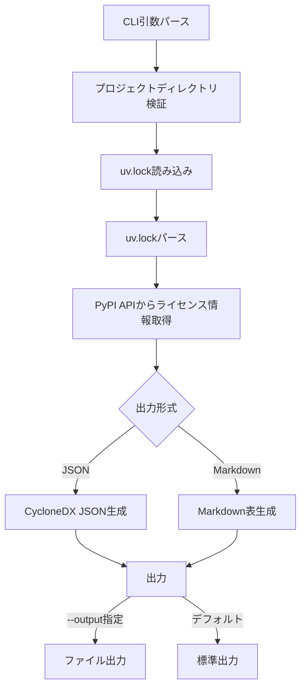

# uv-sbom プロジェクトコンテキスト

このファイルは、Claude Codeや他の開発者がプロジェクトの完全なコンテキストを理解するためのものです。

## プロジェクト概要

**uv-sbom** は、Pythonのパッケージマネージャー[uv](https://github.com/astral-sh/uv)で管理されているプロジェクトから、SBOM (Software Bill of Materials) を生成するRust製のCLIツールです。

### 主要な目的
- uvプロジェクトの依存関係を可視化
- セキュリティ監査やコンプライアンスのためのSBOM生成
- ライセンス情報の自動収集と報告

### バージョン情報
- 現在のバージョン: 0.1.0
- Rust Edition: 2021
- CycloneDX仕様: 1.6

## 技術スタック

### 主要な依存関係
```toml
clap = "4.5"                 # CLI引数パース (derive機能使用)
serde = "1.0"                # シリアライゼーション (derive機能使用)
serde_json = "1.0"           # JSON処理
toml = "0.8"                 # TOML (uv.lock) パース
anyhow = "1.0"               # エラーハンドリング
reqwest = "0.12"             # HTTP クライアント (blocking機能使用)
chrono = "0.4"               # 日時処理
uuid = "1.10"                # UUID生成 (v4機能使用)
```

## アーキテクチャ

### モジュール構成と責務

```
src/
├── main.rs          # エントリーポイント、全体のフロー制御、エラーハンドリング
├── cli.rs           # CLIインターフェース定義 (clap使用)
├── lockfile.rs      # uv.lockファイル (TOML) のパース
├── license.rs       # PyPI APIからのライセンス情報取得 (リトライ機能付き)
├── cyclonedx.rs     # CycloneDX 1.6 JSON形式の生成
├── markdown.rs      # Markdown表形式の生成
└── error.rs         # カスタムエラー型定義 (詳細なメッセージ付き)
```

### データフロー



### 主要なデータ構造

#### Package (lockfile.rs)
```rust
pub struct Package {
    pub name: String,           // パッケージ名
    pub version: String,        // 正確なバージョン (uv.lockから)
    pub description: Option<String>,  // PyPI APIから取得
    pub license: Option<String>,      // PyPI APIから取得
}
```

#### CLI Args (cli.rs)
```rust
pub struct Args {
    pub format: OutputFormat,   // json | markdown (デフォルト: json)
    pub path: Option<String>,   // プロジェクトパス (デフォルト: ".")
    pub output: Option<String>, // 出力ファイルパス (デフォルト: 標準出力)
}
```

#### SbomError (error.rs)
```rust
pub enum SbomError {
    LockfileNotFound { path, suggestion },
    LockfileParseError { path, details },
    LicenseFetchError { package_name, details },
    OutputGenerationError { format, details },
    FileWriteError { path, details },
    InvalidProjectPath { path, reason },
}
```

## 重要な設計決定とその理由

### 1. データソース: uv.lock
**決定**: uv.lockファイルをパースしてパッケージ情報を取得

**理由**:
- ✅ 正確なバージョン情報 (ロックファイル)
- ✅ 高速なパース (ファイル読み込みのみ)
- ✅ uvのインストール不要
- ✅ 再現性が高い

**代替案と却下理由**:
- `uv pip list` 実行: uvのインストールが必要、プロセス起動のオーバーヘッド
- `pyproject.toml`: バージョン範囲のみで正確なバージョン不明

### 2. ライセンス情報: PyPI API
**決定**: PyPI JSON APIからライセンス情報と説明を取得

**API エンドポイント**: `https://pypi.org/pypi/{name}/{version}/json`

**取得ロジック**:
1. `info.license` フィールドをチェック
2. 空または"UNKNOWN"の場合、`classifiers` から抽出
3. パターンマッチ: "License :: OSI Approved :: {ライセンス名}"

**リトライ戦略**:
- 最大3回まで自動リトライ
- リトライ間隔: 100ms × 試行回数
- タイムアウト: 10秒/リクエスト
- User-Agent: `uv-sbom/0.1.0`

**エラーハンドリング**:
- 失敗してもパッケージを除外せず継続
- 警告メッセージを表示
- 成功/失敗の統計を表示

### 3. 出力形式: CycloneDX 1.6 と Markdown
**CycloneDX 1.6 JSON**:
- 標準的なSBOMフォーマット
- ツール連携が容易
- 豊富なメタデータサポート

**Markdown表**:
- 人間が読みやすい
- GitHubで直接表示可能
- レビューやドキュメント化が容易

**カラム**: パッケージ名 | バージョン | ライセンス | 説明

### 4. エラーハンドリング: ユーザーフレンドリー
**方針**:
- 日本語のエラーメッセージ
- 具体的な解決策の提案 (💡マーク付き)
- エラーチェーンの表示
- パス情報を明示

**例**:
```
❌ エラーが発生しました:

uv.lockファイルが見つかりません: /path/to/project/uv.lock

💡 ヒント: プロジェクトディレクトリにuv.lockファイルが存在しません。
   uvプロジェクトのルートディレクトリで実行するか、
   --pathオプションで正しいパスを指定してください。
```

## 実装の詳細

### main.rs の実行フロー

```rust
fn main() {
    if let Err(e) = run() {
        // エラー表示とエラーチェーンの出力
        eprintln!("\n❌ エラーが発生しました:\n");
        eprintln!("{}", e);

        // エラーの根本原因まで辿る
        let mut source = e.source();
        while let Some(err) = source {
            eprintln!("\n原因: {}", err);
            source = err.source();
        }

        process::exit(1);
    }
}

fn run() -> Result<()> {
    // 1. CLI引数パース
    let args = Args::parse_args();

    // 2. プロジェクトディレクトリ検証
    let project_path = PathBuf::from(args.path.unwrap_or("."));
    validate_project_path(&project_path)?;

    // 3. uv.lockファイルの存在確認
    let lockfile_path = project_path.join("uv.lock");
    if !lockfile_path.exists() {
        return Err(SbomError::LockfileNotFound { ... });
    }

    // 4. uv.lockファイルの読み込み・パース
    eprintln!("📖 uv.lockファイルを読み込んでいます...");
    let content = fs::read_to_string(&lockfile_path)?;
    let packages = lockfile::parse_lockfile(&content)?;

    // 5. ライセンス情報取得
    eprintln!("🔍 ライセンス情報を取得しています...");
    let packages = license::fetch_licenses(packages)?;

    // 6. 出力生成
    eprintln!("📝 {}形式で出力を生成しています...", format_name);
    let output = match args.format {
        Json => cyclonedx::generate_bom(packages)?,
        Markdown => markdown::generate_table(packages),
    };

    // 7. 出力
    if let Some(path) = args.output {
        fs::write(&path, output)?;
        eprintln!("✅ 出力完了: {}", path);
    } else {
        io::stdout().write_all(output.as_bytes())?;
    }

    Ok(())
}
```

### license.rs のリトライロジック

```rust
fn fetch_from_pypi_with_retry(
    client: &Client,
    name: &str,
    version: &str,
) -> Result<(Option<String>, Option<String>)> {
    const MAX_RETRIES: u32 = 3;
    let mut last_error = None;

    for attempt in 1..=MAX_RETRIES {
        match fetch_from_pypi(client, name, version) {
            Ok(result) => return Ok(result),
            Err(e) => {
                last_error = Some(e);
                if attempt < MAX_RETRIES {
                    // 指数バックオフではなく線形バックオフ
                    std::thread::sleep(Duration::from_millis(100 * attempt as u64));
                }
            }
        }
    }

    Err(last_error.unwrap())
}
```

### プログレス表示

```rust
// リアルタイムで進捗を表示
eprint!(
    "\r   進捗: {}/{} ({:.1}%) - {}",
    idx + 1,
    total,
    ((idx + 1) as f64 / total as f64) * 100.0,
    package.name
);

// 完了時の統計
eprintln!("✅ ライセンス情報取得完了: 成功 {}/{}, 失敗 {}", successful, total, failed);
```

## テスト戦略

### ユニットテストの場所
各モジュールに`#[cfg(test)]`セクションを配置:

- `lockfile.rs`: uv.lockのパースロジックをテスト
- `license.rs`: ライセンス抽出ロジックをテスト (API呼び出しは含まない)
- `cyclonedx.rs`: BOM生成ロジックをテスト
- `markdown.rs`: 表生成とエスケープ処理をテスト

### サンプルプロジェクト
`examples/sample-project/` に実際のuv.lockファイルを配置:
- 5つの実パッケージ (requests, certifi, charset-normalizer, idna, urllib3)
- 依存関係を含む
- 手動テスト・E2Eテストに使用

### テスト実行
```bash
# 全テスト
cargo test

# 詳細出力
cargo test -- --nocapture

# サンプルプロジェクトでの手動テスト
cargo run -- --path examples/sample-project --format markdown
```

## 開発ワークフロー

### ビルド
```bash
# デバッグビルド
cargo build

# リリースビルド
cargo build --release

# 実行
cargo run -- --help
cargo run -- --path examples/sample-project --format json
```

### コード品質
```bash
# フォーマット確認
cargo fmt -- --check

# フォーマット適用
cargo fmt

# Linting
cargo clippy -- -D warnings
```

## パフォーマンス特性

### 処理時間の見積もり
- **uv.lockパース**: < 100ms
- **ライセンス情報取得**: パッケージ数 × 100-500ms
  - ネットワークレイテンシに依存
  - リトライ時は最大1.5秒/パッケージ
- **出力生成**: < 50ms

### ボトルネック
- PyPI API呼び出し (逐次処理)
- ネットワークレイテンシ

### 最適化の余地
1. **並列処理**: tokioで非同期処理化
2. **キャッシュ**: PyPI APIレスポンスをローカルDB保存
3. **バッチ処理**: 複数パッケージを一度にクエリ (API制限に注意)

## エラーケースと対処

### よくあるエラー

1. **uv.lockが見つからない**
   - 原因: 間違ったディレクトリで実行
   - 解決: `--path`オプションで正しいパスを指定

2. **ライセンス情報取得失敗**
   - 原因: ネットワーク問題、PyPI API障害、パッケージ不在
   - 対処: 自動リトライ、失敗してもパッケージは含める

3. **ファイル書き込み失敗**
   - 原因: 親ディレクトリ不在、権限不足
   - 解決: ディレクトリ作成、権限確認

## セキュリティ考慮事項

1. **外部API依存**
   - PyPI APIへの信頼 (HTTPS通信)
   - タイムアウト設定でDoS防止

2. **ファイル操作**
   - パストラバーサル対策
   - ファイル書き込み権限チェック

3. **エラー情報の露出**
   - パス情報をエラーメッセージに含む
   - 機密情報の漏洩リスク (最小限)

## 拡張可能性

### 将来の機能候補

1. **キャッシュ機能**
   - SQLiteでPyPI APIレスポンスをキャッシュ
   - TTL設定 (例: 7日)

2. **並列処理**
   - `reqwest`の非同期版を使用
   - `tokio`ランタイムで並列化

3. **追加のSBOMフォーマット**
   - SPDX 2.3
   - SWID

4. **脆弱性情報**
   - OSV API連携
   - 既知の脆弱性を報告

5. **ローカルメタデータ読み込み**
   - インストール済みパッケージの`METADATA`ファイル
   - オフライン動作サポート

## トラブルシューティング

### ビルドエラー

**問題**: `cargo build`が失敗する
**確認事項**:
1. Rustのバージョン (1.70以上推奨)
2. インターネット接続 (依存関係のダウンロード)
3. `Cargo.lock`の削除後に再ビルド

### ランタイムエラー

**問題**: PyPI APIタイムアウト
**解決策**:
1. インターネット接続確認
2. プロキシ設定確認
3. リトライが3回実行されているか確認

**問題**: uv.lockパースエラー
**解決策**:
1. uv.lockファイルの形式確認
2. uvのバージョン確認 (異なる形式の可能性)
3. TOMLの構文エラー確認

## 貢献ガイドライン

### コーディング規約
- Rust標準スタイル (`cargo fmt`)
- Clippyの警告をすべて解消
- 新機能には必ずテストを追加
- エラーメッセージは日本語で分かりやすく

### プルリクエスト
1. 機能ブランチを作成
2. テストを追加・実行
3. `cargo fmt`と`cargo clippy`を実行
4. ドキュメントを更新
5. PRを作成

## 連絡先・リソース

- **GitHub**: https://github.com/yourusername/uv-sbom
- **Issues**: バグ報告・機能要望
- **Documentation**: README.md, DEVELOPMENT.md
- **License**: MIT

## 補足情報

### CycloneDX 1.6 仕様
- 公式ドキュメント: https://cyclonedx.org/docs/1.6/
- PURL形式: `pkg:pypi/{package_name}@{version}`

### PyPI JSON API
- ドキュメント: https://warehouse.pypa.io/api-reference/json.html
- エンドポイント: `https://pypi.org/pypi/{name}/{version}/json`
- レート制限: 明示的な制限なし (常識的な範囲で使用)

### uv
- 公式サイト: https://github.com/astral-sh/uv
- uv.lock形式: TOML形式、パッケージごとに`[[package]]`セクション
