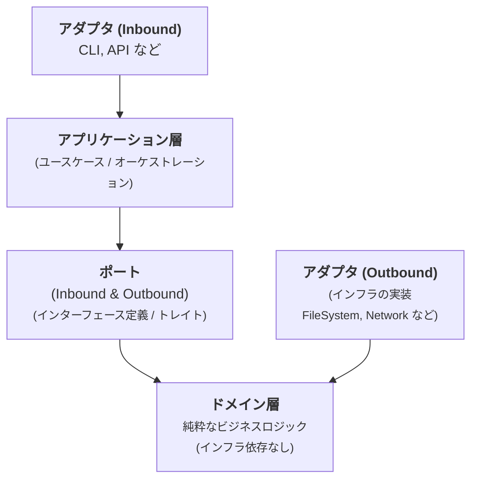

# アーキテクチャドキュメント

## 概要

このプロジェクトは、**ヘキサゴナルアーキテクチャ**（ポート&アダプター）と**ドメイン駆動設計(DDD)**の原則を組み合わせています。アーキテクチャは以下を実現するよう設計されています:

- **テスト可能性**: インフラストラクチャから分離された純粋なドメインロジック
- **柔軟性**: 実装の容易な入れ替え（例：異なるライセンス情報源）
- **保守性**: 関心の明確な分離
- **叫ぶアーキテクチャ**: ディレクトリ構造がビジネスの意図を表現

## アーキテクチャレイヤー



## ディレクトリ構造

```
src/
├── main.rs                          # エントリーポイント（DI配線のみ）
├── lib.rs                           # ライブラリルート、パブリックAPI
├── cli.rs                           # CLI引数パース
│
├── sbom_generation/                 # ドメイン層（純粋なビジネスロジック）
│   ├── domain/                      # バリューオブジェクトと集約
│   ├── services/                    # ドメインサービス（純粋関数）
│   └── policies/                    # ビジネスルールとポリシー
│
├── application/                     # アプリケーション層（ユースケース）
│   ├── use_cases/                   # ユースケースのオーケストレーション
│   ├── dto/                         # データ転送オブジェクト
│   └── factories/                   # ファクトリーパターン実装
│
├── ports/                           # ポート（トレイトインターフェース）
│   ├── inbound/                     # 駆動するポート（現在は直接ユースケース呼び出しを使用）
│   └── outbound/                    # 駆動されるポート（インフラストラクチャインターフェース）
│
├── adapters/                        # アダプター（インフラストラクチャ）
│   ├── inbound/                     # インバウンドアダプター（将来の使用のため予約）
│   └── outbound/                    # アウトバウンドアダプター
│       ├── filesystem/              # ファイルI/O実装
│       ├── network/                 # HTTPクライアント実装
│       ├── formatters/              # 出力フォーマット実装
│       └── console/                 # コンソールI/O実装
│
└── shared/                          # 共有カーネル
    ├── error.rs                     # ドメインエラー
    ├── result.rs                    # 型エイリアス
    └── security.rs                  # セキュリティ検証ユーティリティ
```

**注記**: この構造は高レベルの組織を示しています。各ディレクトリ内の個別のファイルは、ヘキサゴナルアーキテクチャの原則に従って、特定のドメイン概念、ユースケース、ポート、アダプターを実装します。

## ドメイン層

### バリューオブジェクト
- **PackageName**: バリデーション付きNewTypeラッパー（空でない）
- **Version**: バリデーション付きNewTypeラッパー（空でない）
- **Package**: 不変なパッケージ表現
- **LicenseInfo**: ライセンスと説明情報

### 集約
- **DependencyGraph**: 直接依存と推移的依存を含む完全な依存構造

### ドメインサービス
- **DependencyAnalyzer**: 循環検出付き依存グラフの分析と構築
- **SbomGenerator**: SBOMメタデータ生成（タイムスタンプ、シリアル番号、ツール情報）
- **VulnerabilityChecker**: 設定可能なしきい値（深刻度レベルまたはCVSSスコア）に対する脆弱性評価

### ポリシー
- **LicensePriority**: ライセンス選択のビジネスルール（license > license_expression > classifiers）

**重要な原則:**
- ✅ インフラストラクチャ依存なし（`std::fs`、`reqwest`など使用禁止）
- ✅ 可能な限り純粋関数
- ✅ バリデーション付きリッチドメインモデル
- ✅ ビジネスロジックの明示的な表現

## アプリケーション層

### ユースケース

#### GenerateSbomUseCase
SBOM生成ワークフローのオーケストレーション

```rust
pub struct GenerateSbomUseCase<LR, PCR, LREPO, PR> {
    lockfile_reader: LR,
    project_config_reader: PCR,
    license_repository: LREPO,
    progress_reporter: PR,
}
```

**ワークフロー:**
1. ロックファイルの内容を読み取る
2. ロックファイルをパースしてパッケージを抽出
3. プロジェクト設定を読み取る
4. 依存関係を分析（要求された場合）
5. ライセンス情報でパッケージを充実化
6. SBOMメタデータを生成
7. レスポンスDTOを返す

**エラーハンドリング:**
- ロックファイル/設定読み取り失敗 → エラー
- ライセンス取得失敗 → 警告（ライセンス情報なしでパッケージを含める）
- 不正なTOML → エラー

#### CheckVulnerabilitiesUseCase
しきい値サポート付き脆弱性チェックのオーケストレーション

```rust
pub struct CheckVulnerabilitiesUseCase<R: VulnerabilityRepository> {
    vulnerability_repository: R,
}
```

**ワークフロー:**
1. 除外されたパッケージをフィルタリング
2. リポジトリ（OSV API）から脆弱性を取得
3. VulnerabilityCheckerを使用してしきい値評価を適用
4. しきい値以上/以下で分類された構造化レスポンスを返す

**しきい値評価フロー:**
```
パッケージ → 脆弱性取得 → しきい値適用 → 結果の分類
                                ↓
                    ┌───────────┴───────────┐
                    ↓                       ↓
              しきい値以上             しきい値以下
              (終了コード1)            (情報として表示)
```

**しきい値タイプ:**
- `ThresholdConfig::None` - すべての脆弱性が終了コード1をトリガー
- `ThresholdConfig::Severity(level)` - 深刻度でフィルタ（Low/Medium/High/Critical）
- `ThresholdConfig::Cvss(score)` - CVSSスコアでフィルタ（0.0-10.0）

## ポート（インターフェース）

### アウトバウンドポート（駆動されるポート）
- **LockfileReader**: ファイルシステムからロックファイルを読み取る
- **ProjectConfigReader**: pyproject.tomlからプロジェクト名を読み取る
- **LicenseRepository**: ライセンス情報を取得（例：PyPIから）
- **SbomFormatter**: SBOMを出力形式にフォーマット（JSON、Markdown）
- **OutputPresenter**: 出力を提示（stdout、ファイル）
- **ProgressReporter**: ユーザーに進捗を報告

### インバウンドポート（駆動するポート）
現在、アプリケーションはインバウンドポートの代わりに直接ユースケース呼び出しを使用しています。これはヘキサゴナルアーキテクチャの有効なパターンです。

## アダプター

### アウトバウンドアダプター（インフラストラクチャ）

**FileSystemアダプター:**
- `FileSystemReader`: LockfileReaderとProjectConfigReaderを実装
- `FileSystemWriter`: ファイル出力用OutputPresenterを実装
- `StdoutPresenter`: 標準出力用OutputPresenterを実装

**Networkアダプター:**
- `PyPiLicenseRepository`: リトライロジック付きLicenseRepositoryを実装

**Formatterアダプター:**
- `CycloneDxFormatter`: CycloneDX 1.6 JSON形式を生成
- `MarkdownFormatter`: 依存セクション付きMarkdownを生成

**Consoleアダプター:**
- `StderrProgressReporter`: 標準エラー出力用ProgressReporterを実装

## 依存性注入パターン

このプロジェクトは、依存性注入に**ジェネリックベースの静的ディスパッチ**を使用します:

```rust
impl<LR, PCR, LREPO, PR> GenerateSbomUseCase<LR, PCR, LREPO, PR>
where
    LR: LockfileReader,
    PCR: ProjectConfigReader,
    LREPO: LicenseRepository,
    PR: ProgressReporter,
{
    // ...
}
```

**利点:**
- ✅ ランタイムオーバーヘッドゼロ（静的ディスパッチ）
- ✅ コンパイル時の型安全性
- ✅ モックでのテストが容易
- ✅ トレイトオブジェクト不要

**`main.rs`でのDI配線:**
```rust
fn run() -> Result<()> {
    let args = Args::parse_args();

    // 具体的なアダプターを作成
    let lockfile_reader = FileSystemReader::new();
    let project_config_reader = FileSystemReader::new();
    let license_repository = PyPiLicenseRepository::new()?;
    let progress_reporter = StderrProgressReporter::new();

    // ユースケースに注入
    let use_case = GenerateSbomUseCase::new(
        lockfile_reader,
        project_config_reader,
        license_repository,
        progress_reporter,
    );

    // 実行
    let response = use_case.execute(request)?;
    // ...
}
```

## テスト戦略

### テストピラミッド

```
        ╱╲
       ╱  ╲       E2Eテスト
      ╱────╲      - フィクスチャを使った完全なワークフロー
     ╱      ╲
    ╱────────╲    統合テスト
   ╱          ╲   - モックを使ったユースケース
  ╱────────────╲
 ╱              ╲ ユニットテスト
╱────────────────╲ - ドメインロジック、アダプター
```

プロジェクトは包括的なテストスイートを持ち、すべての層をカバーしています。

### テストアーキテクチャ

**モック (tests/test_utilities/mocks/):**
- `MockLockfileReader`
- `MockProjectConfigReader`
- `MockLicenseRepository`
- `MockProgressReporter` (メッセージキャプチャ付き)

**統合テスト:**
- ハッピーパス
- 依存グラフ生成
- エラーシナリオ（ロックファイル不在、不正なTOMLなど）
- プログレス報告の検証

**E2Eテスト:**
- JSON形式出力
- Markdown形式出力
- 存在しないプロジェクトの処理
- フィクスチャベースの検証

**カバレッジ目標:**
- ドメイン層: 100% ✅
- アプリケーション層: 90%+ ✅
- アダプター: 80%+ ✅

## 設計上の決定（ADR）

### ADR-001: ヘキサゴナルアーキテクチャ
**背景**: SBOM生成のためのテスト可能で保守可能なアーキテクチャが必要。

**決定**: ポート&アダプターを用いたヘキサゴナルアーキテクチャを採用。

**結果:**
- ✅ ドメインロジックがインフラストラクチャから完全に分離
- ✅ 実装の容易な入れ替え（例：異なるライセンス情報源）
- ✅ モックでテスト可能
- ⚠️ シンプルなアーキテクチャよりもファイル/ボイラープレートが多い

### ADR-002: ジェネリックベースの依存性注入
**背景**: ランタイムオーバーヘッドゼロでコンパイル時の型安全性が必要。

**決定**: トレイトオブジェクトの代わりにジェネリック静的ディスパッチを使用。

**結果:**
- ✅ ランタイムオーバーヘッドゼロ
- ✅ コンパイル時の型チェック
- ✅ Box<dyn Trait>アロケーション不要
- ⚠️ やや複雑な型シグネチャ
- ⚠️ わずかに長いコンパイル時間

### ADR-003: ライセンス取得失敗を警告として扱う
**背景**: ライセンス情報が利用できない、またはネットワークが失敗する可能性がある。

**決定**: ライセンス取得失敗をエラーではなく警告として扱う。ライセンス情報なしでパッケージを含める。

**結果:**
- ✅ ネットワーク問題があってもSBOM生成が成功
- ✅ ユーザーは何もないよりも部分的な情報を取得
- ⚠️ ユーザーは欠落しているライセンスの警告を確認する必要がある

### ADR-004: リファクタリング後の後方互換性なし
**背景**: 7ファイルから50ファイルのアーキテクチャへ移行。

**決定**: 後方互換性を破棄し、未使用のパブリックAPIエクスポートを削除。

**結果:**
- ✅ クリーンで最小限のパブリックAPI表面
- ✅ 未使用コードのメンテナンス負担なし
- ⚠️ ライブラリAPIを使用している既存コードが破損する可能性

### ADR-005: タイムスタンプなしのMarkdown形式
**背景**: ユーザーは安定した、バージョン管理可能なSBOM出力を望む。

**決定**: Markdown出力からタイムスタンプとツールメタデータを削除。

**結果:**
- ✅ バージョン管理差分のための安定した出力
- ✅ ja-completeプロジェクトの参照形式に一致
- ⚠️ 監査証跡情報が少ない

## 将来の検討事項

### 潜在的な機能拡張
1. **SPDX形式サポート**: SpdxFormatterアダプターを追加
2. **GitHub API統合**: GitHubからライセンス情報を取得
3. **キャッシュ層**: API呼び出しを減らすためのLicenseCacheアダプターを追加
4. **非同期ランタイム**: 並行ライセンス取得のために非同期に変換
5. **WASMサポート**: ブラウザ使用のためにWebAssemblyにコンパイル

### スケーラビリティ
- 現在の設計は1000以上のパッケージを持つプロジェクトを効率的に処理
- ネットワークI/Oがボトルネック（ライセンス取得）
- 非同期+キャッシュでパフォーマンスを大幅に改善可能

## 参考資料

- [ヘキサゴナルアーキテクチャ (Alistair Cockburn)](https://alistair.cockburn.us/hexagonal-architecture/)
- [ドメイン駆動設計 (Eric Evans)](https://www.domainlanguage.com/ddd/)
- [CycloneDX仕様](https://cyclonedx.org/specification/overview/)
- [uvパッケージマネージャー](https://github.com/astral-sh/uv)
