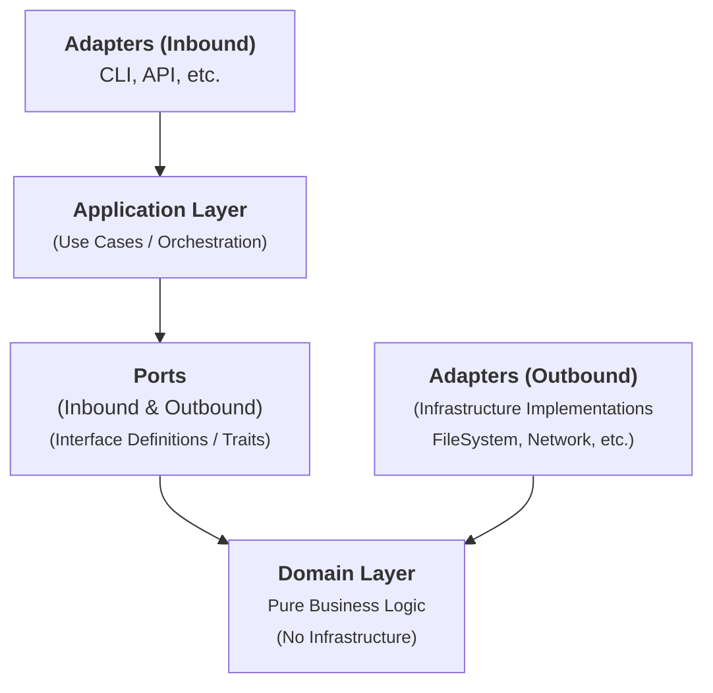

# Architecture Documentation

## Overview

This project follows **Hexagonal Architecture** (Ports and Adapters) combined with **Domain-Driven Design (DDD)** principles. The architecture is designed to be:

- **Testable**: Pure domain logic isolated from infrastructure
- **Flexible**: Easy to swap implementations (e.g., different license sources)
- **Maintainable**: Clear separation of concerns
- **Screaming**: Directory structure expresses business intent

## Architectural Layers



## Directory Structure

```
src/
├── main.rs                          # Entry point (DI wiring only)
├── lib.rs                           # Library root with public API
│
├── sbom_generation/                 # Domain Layer (Pure business logic)
│   ├── domain/
│   │   ├── package.rs               # Package value object (PackageName, Version)
│   │   ├── dependency_graph.rs      # DependencyGraph aggregate
│   │   ├── license_info.rs          # LicenseInfo value object
│   │   └── sbom_metadata.rs         # SBOM metadata
│   ├── services/
│   │   ├── dependency_analyzer.rs   # Transitive dependency algorithm
│   │   └── sbom_generator.rs        # SBOM metadata generation
│   └── policies/
│       └── license_priority.rs      # License selection priority rules
│
├── application/                     # Application Layer (Use Cases)
│   ├── use_cases/
│   │   └── generate_sbom.rs         # GenerateSbomUseCase<LR,PCR,LREPO,PR>
│   └── dto/
│       ├── sbom_request.rs          # Request DTO
│       └── sbom_response.rs         # Response DTO
│
├── ports/                           # Ports (Trait interfaces)
│   ├── inbound/
│   │   └── mod.rs                   # (Currently uses direct use case invocation)
│   └── outbound/
│       ├── lockfile_reader.rs       # LockfileReader trait
│       ├── project_config_reader.rs # ProjectConfigReader trait
│       ├── license_repository.rs    # LicenseRepository trait
│       ├── formatter.rs             # SbomFormatter trait
│       ├── output_presenter.rs      # OutputPresenter trait
│       └── progress_reporter.rs     # ProgressReporter trait
│
├── adapters/                        # Adapters (Infrastructure)
│   ├── inbound/
│   │   └── mod.rs                   # (Reserved for future CLI adapter)
│   └── outbound/
│       ├── filesystem/
│       │   ├── file_reader.rs       # FileSystemReader
│       │   └── file_writer.rs       # FileSystemWriter, StdoutPresenter
│       ├── network/
│       │   └── pypi_client.rs       # PyPiLicenseRepository
│       ├── formatters/
│       │   ├── cyclonedx_formatter.rs  # CycloneDX JSON formatter
│       │   └── markdown_formatter.rs    # Markdown formatter
│       └── console/
│           └── progress_reporter.rs  # StderrProgressReporter
│
├── shared/                          # Shared kernel
│   ├── error.rs                     # Domain errors (SbomError)
│   └── result.rs                    # Type aliases (Result<T>)
│
└── cli.rs                           # CLI argument parsing
```

## Domain Layer

### Value Objects
- **PackageName**: NewType wrapper with validation (non-empty)
- **Version**: NewType wrapper with validation (non-empty)
- **Package**: Immutable package representation
- **LicenseInfo**: License and description information

### Aggregates
- **DependencyGraph**: Complete dependency structure with direct and transitive dependencies

### Domain Services
- **DependencyAnalyzer**: Analyzes and builds dependency graph with cycle detection
- **SbomGenerator**: Generates SBOM metadata (timestamp, serial number, tool info)

### Policies
- **LicensePriority**: Business rules for license selection (license > license_expression > classifiers)

**Key Principles:**
- ✅ No infrastructure dependencies (no `std::fs`, `reqwest`, etc.)
- ✅ Pure functions where possible
- ✅ Rich domain model with validation
- ✅ Business logic explicitly expressed

## Application Layer

### Use Cases
**GenerateSbomUseCase**: Orchestrates the SBOM generation workflow

```rust
pub struct GenerateSbomUseCase<LR, PCR, LREPO, PR> {
    lockfile_reader: LR,
    project_config_reader: PCR,
    license_repository: LREPO,
    progress_reporter: PR,
}
```

**Workflow:**
1. Read lockfile content
2. Parse lockfile to extract packages
3. Read project configuration
4. Analyze dependencies (if requested)
5. Enrich packages with license information
6. Generate SBOM metadata
7. Return response DTO

**Error Handling:**
- Lockfile/config read failures → Error
- License fetch failures → Warning (package included without license)
- Invalid TOML → Error

## Ports (Interfaces)

### Outbound Ports (Driven)
- **LockfileReader**: Reads lockfile from filesystem
- **ProjectConfigReader**: Reads project name from pyproject.toml
- **LicenseRepository**: Fetches license information (e.g., from PyPI)
- **SbomFormatter**: Formats SBOM to output format (JSON, Markdown)
- **OutputPresenter**: Presents output (stdout, file)
- **ProgressReporter**: Reports progress to user

### Inbound Ports (Driving)
Currently, the application uses direct use case invocation instead of inbound ports, which is a valid hexagonal architecture pattern.

## Adapters

### Outbound Adapters (Infrastructure)

**FileSystem Adapters:**
- `FileSystemReader`: Implements LockfileReader and ProjectConfigReader
- `FileSystemWriter`: Implements OutputPresenter for file output
- `StdoutPresenter`: Implements OutputPresenter for stdout

**Network Adapters:**
- `PyPiLicenseRepository`: Implements LicenseRepository with retry logic

**Formatter Adapters:**
- `CycloneDxFormatter`: Generates CycloneDX 1.6 JSON format
- `MarkdownFormatter`: Generates Markdown with dependency sections

**Console Adapters:**
- `StderrProgressReporter`: Implements ProgressReporter for stderr output

## Dependency Injection Pattern

This project uses **Generic-based static dispatch** for dependency injection:

```rust
impl<LR, PCR, LREPO, PR> GenerateSbomUseCase<LR, PCR, LREPO, PR>
where
    LR: LockfileReader,
    PCR: ProjectConfigReader,
    LREPO: LicenseRepository,
    PR: ProgressReporter,
{
    // ...
}
```

**Benefits:**
- ✅ Zero runtime overhead (static dispatch)
- ✅ Type-safe at compile time
- ✅ Easy to test with mocks
- ✅ No trait objects needed

**DI Wiring in `main.rs`:**
```rust
fn run() -> Result<()> {
    let args = Args::parse_args();

    // Create concrete adapters
    let lockfile_reader = FileSystemReader::new();
    let project_config_reader = FileSystemReader::new();
    let license_repository = PyPiLicenseRepository::new()?;
    let progress_reporter = StderrProgressReporter::new();

    // Inject into use case
    let use_case = GenerateSbomUseCase::new(
        lockfile_reader,
        project_config_reader,
        license_repository,
        progress_reporter,
    );

    // Execute
    let response = use_case.execute(request)?;
    // ...
}
```

## Test Strategy

### Test Pyramid

```
        ╱╲
       ╱  ╲       E2E Tests
      ╱────╲      - Full workflow with fixtures
     ╱      ╲
    ╱────────╲    Integration Tests
   ╱          ╲   - Use case with mocks
  ╱────────────╲
 ╱              ╲ Unit Tests
╱────────────────╲ - Domain logic, adapters
```

The project has a comprehensive test suite covering all layers.

### Test Architecture

**Mocks (tests/test_utilities/mocks/):**
- `MockLockfileReader`
- `MockProjectConfigReader`
- `MockLicenseRepository`
- `MockProgressReporter` (with message capture)

**Integration Tests:**
- Happy path
- Dependency graph generation
- Error scenarios (lockfile missing, invalid TOML, etc.)
- Progress reporting verification

**E2E Tests:**
- JSON format output
- Markdown format output
- Nonexistent project handling
- Fixture-based validation

**Coverage Goals:**
- Domain layer: 100% ✅
- Application layer: 90%+ ✅
- Adapters: 80%+ ✅

## Design Decisions (ADR)

### ADR-001: Hexagonal Architecture
**Context**: Need testable, maintainable architecture for SBOM generation.

**Decision**: Adopt Hexagonal Architecture with Ports and Adapters.

**Consequences:**
- ✅ Domain logic completely isolated from infrastructure
- ✅ Easy to swap implementations (e.g., different license sources)
- ✅ Testable with mocks
- ⚠️ More files/boilerplate than simple architecture

### ADR-002: Generic-based Dependency Injection
**Context**: Need compile-time type safety with zero runtime overhead.

**Decision**: Use Generic static dispatch instead of trait objects.

**Consequences:**
- ✅ Zero runtime overhead
- ✅ Compile-time type checking
- ✅ No Box<dyn Trait> allocations
- ⚠️ Slightly more complex type signatures
- ⚠️ Longer compile times (marginal)

### ADR-003: License Fetch Failures as Warnings
**Context**: License information may be unavailable or network may fail.

**Decision**: Treat license fetch failures as warnings, not errors. Include packages without license info.

**Consequences:**
- ✅ SBOM generation succeeds even with network issues
- ✅ User gets partial information instead of nothing
- ⚠️ User must check warnings for missing licenses

### ADR-004: No Backward Compatibility After Refactoring
**Context**: Migrating from 7-file to 50-file architecture.

**Decision**: Break backward compatibility, remove unused public API exports.

**Consequences:**
- ✅ Clean, minimal public API surface
- ✅ No maintenance burden for unused code
- ⚠️ Existing code using library API may break

### ADR-005: Markdown Format Without Timestamps
**Context**: Users want stable, version-controllable SBOM output.

**Decision**: Remove timestamps and tool metadata from Markdown output.

**Consequences:**
- ✅ Stable output for version control diffs
- ✅ Matches reference format from ja-complete project
- ⚠️ Less audit trail information

## Future Considerations

### Potential Enhancements
1. **SPDX Format Support**: Add SpdxFormatter adapter
2. **GitHub API Integration**: Fetch license info from GitHub
3. **Cache Layer**: Add LicenseCache adapter to reduce API calls
4. **Async Runtime**: Convert to async for concurrent license fetching
5. **WASM Support**: Compile to WebAssembly for browser usage

### Scalability
- Current design handles projects with 1000+ packages efficiently
- Network I/O is the bottleneck (license fetching)
- Async + caching would improve performance significantly

## References

- [Hexagonal Architecture (Alistair Cockburn)](https://alistair.cockburn.us/hexagonal-architecture/)
- [Domain-Driven Design (Eric Evans)](https://www.domainlanguage.com/ddd/)
- [CycloneDX Specification](https://cyclonedx.org/specification/overview/)
- [uv Package Manager](https://github.com/astral-sh/uv)
